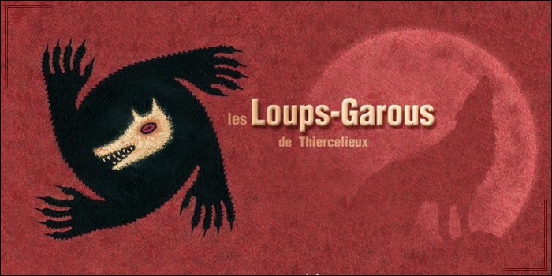

# Documentation pour le mode Minecraft Loup Garou

Github de la documentation : [https://github.com/jvin042/minecraft-loup-garou-wiki](https://github.com/jvin042/minecraft-loup-garou-wiki)

## Table des matières

- [À propos](#à-propos)
- [Installation](#installation)
- [Commandes](#commandes)
- [Tutoriels vidéos](#tutoriels-vidéos)
- [Ressources](#ressources)
- [Crédits](#crédits)
- [FAQ](#faq)

## À propos

Le mode Loup-Garou est un mode inspiré du jeu de société [Les Loups-Garous de Thiercelieux](https://fr.wikipedia.org/wiki/Les_Loups-garous_de_Thiercelieux) reprenant son fonctionnement ainsi que sa manière d'être joué, à la seule différence qu'aucun maître du jeu n'est requis, le déroulement de chaque partie étant entièrement automatisé :

- Déroulement de la partie automatisé
- Rôles du jeu de base, et nouveaux rôles
- Utilisable sur n'importe quelle map

[Liste des rôles Loup-Garou](http://bit.ly/30lDmqw)

## Installation

Suivre le lien suivant : [https://github.com/leomelki/LoupGarou](https://github.com/leomelki/LoupGarou)
 pour installé sur votre serveur !

Un tutoriel vidéo est disponible pour l'installé sur votre ordinateur !

## Commandes

`/lg roles` : Retourne la liste des rôles dans la partie  
`/lg roles set <ID> <MONTANT>` : Définit le nombre de joueurs pour un certain rôle  
`/lg addSpawn` : Ajoute un point de spawn (emplacement de joueur)  
`/lg start <PSEUDO>` : Lance la partie  
`/lg end <PSEUDO>` : Arrête une partie  
`/lg reloadConfig` : Recharge la configuration  
`/lg joinAll` : À utiliser après avoir changé les rôles

## Tutoriels vidéos

- [Créer son serveur sur son ordinateur !](https://www.youtube.com/watch?v=q9XjDe1Ao6s)

## Ressources

N'hésitez pas à proposé vos maps sur ce github : [https://github.com/jvin042/minecraft-loup-garou-maps](https://github.com/jvin042/minecraft-loup-garou-maps)

- [config.yml pour la map Village avec spawns prédéfinis](https://github.com/jvin042/minecraft-loup-garou-maps/blob/master/village/config.yml)
- [config.yml pour la map Medieval avec spawns prédéfinis](https://github.com/jvin042/minecraft-loup-garou-maps/blob/master/mediaeval/config.yml)

## Crédits

- Chef de Projet : [Shytoos](https://twitter.com/shytoos_)
- Développement : [Leomelki](https://twitter.com/leomelki)
- Mapping : [Cosii](https://www.youtube.com/channel/UCwyOcA41QSk590fl9L0ys8A)

### FAQ

- ### J'ai mal placés mes spawns ou je veux utiliser une nouvelle map, comment faire ?

Supprimer le fichier plugins\LoupGarou\config.yml et relancer le serveur.

- ### Puis-je mettre plusieurs fois le même rôle dans une seule partie ?

Cela est possible pour les rôles Loup-Garou, Villageois et Chasseur. D'autres rôles peuvent aussi marcher mais n'ont pas été testés avec plusieurs joueurs ayant ce rôle dans une seule partie. C'est à vos risques et périls.

- ### Pourquoi la partie ne se lance pas ?

Il faut taper la commande /lg start <PSEUDO> en mettant le pseudo d'un des joueurs qui sera présent dans la partie. Si cela ne fonctionne toujours pas, c'est parce qu'il n'y a pas suffisamment de rôles pour le nombre de joueurs, il doit y avoir le même nombre de rôles qu'il y aura de joueurs dans la partie. N'oubliez pas de taper /lg joinAll après avoir modifié la liste des rôles.

Vidéo explicative : [https://youtu.be/q9XjDe1Ao6s?t=240](https://youtu.be/q9XjDe1Ao6s?t=240)

- ### J'ai une erreur "an internal error occured while attempting to perform this command" que faire ?

Supprimer le fichier plugins\LoupGarou\config.yml et relancer le serveur.

- ### J'ai une erreur "Il vous faut le resourcepack pour jouer ! (FAILED_DOWNLOAD)" que faire ?

Il suffit d'aller dans ton menu minecraft multijoueur, puis de cliquer une fois sur ton serveur, et enfin sur le bouton "Modifier", Puis tu peut sélectionner "Activé" pour l'option du ressources pack.